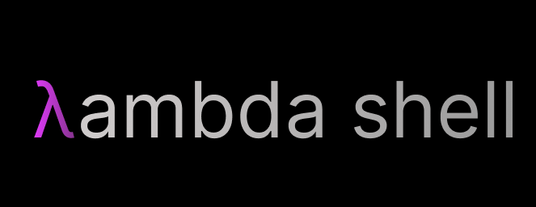

<div align="center">



# λ Lambda Shell

[](https://app.codecrafters.io/users/codecrafters-bot?r=2qF)
[](https://opensource.org/licenses/MIT)
[](https://en.wikipedia.org/wiki/C23_(C_standard_revision))

*A modern, lightweight POSIX-compliant shell built with C*

**🚀 Part of the [CodeCrafters Shell Challenge](https://app.codecrafters.io/courses/shell/overview)**

</div>

---

## ✨ Features

- **🔧 Built-in Commands**: Support for essential shell built-ins
  - `echo` - Display text with advanced argument handling
  - `exit` - Graceful shell termination with optional exit codes
  - `type` - Command type identification and path resolution
  - `clear` - Terminal clearing functionality

- **🌐 External Program Execution**: Seamlessly run external programs from your PATH
- **🎯 POSIX Compliance**: Follows POSIX standards for shell behavior
- **⚡ Lightweight**: Minimal footprint with maximum performance
- **🔍 Smart Path Resolution**: Intelligent executable discovery across PATH directories
- **🛡️ Robust Error Handling**: Comprehensive error reporting and recovery

## 🏗️ Architecture

```
lambda-shell/
├── src/
│   ├── main.c           # Main shell loop and command processing
│   ├── tests.c          # Test suite
│   └── utils/
│       └── utils.h      # Utility functions and data structures
├── build/               # Build artifacts
├── CMakeLists.txt       # CMake configuration
└── your_program.sh      # Local execution script
```

## 🚀 Quick Start

### Prerequisites

- **CMake** (version 3.13 or higher)
- **GCC** or **Clang** with C23 support
- **vcpkg** (for dependency management)

### Building & Running

1. **Clone the repository**
   ```bash
   git clone <repository-url>
   cd lambda-shell
   ```

2. **Build the project**
   ```bash
   cmake . && make
   ```
   
   Or use the build script:
   ```bash
   ./build.sh
   ```

3. **Start the shell**
   ```bash
   ./bin/shell
   ```

4. **Start exploring!**
   ```bash
   λ echo "Hello, Lambda Shell!"
   λ type echo
   λ ls -la
   λ exit
   ```

## 💡 Usage Examples

### Built-in Commands

```bash
# Echo with arguments
λ echo Hello World!
Hello World!

# Type command identification
λ type echo
echo is a shell builtin

λ type ls
ls found in /bin/ls

# Exit with custom code
λ exit 0
```

### External Commands

```bash
# Run any external program
λ ls -la
λ cat file.txt
λ python3 script.py
λ git status
```

## 🔧 Technical Details

### Command Processing Pipeline

1. **Input Reading**: Capture user input with `fgets()`
2. **Parsing**: Tokenize and parse commands using custom string utilities
3. **Built-in Check**: Identify if command is a shell built-in
4. **PATH Resolution**: Search executable locations across PATH directories
5. **Execution**: Execute built-ins directly or fork external processes
6. **Error Handling**: Provide meaningful error messages and recovery

### Key Components

- **`main.c`**: Core REPL (Read-Eval-Print Loop) implementation
- **`utils.h`**: Comprehensive utility library featuring:
  - String manipulation functions (`split`, `slice_from`, `trim`)
  - Command type checking (`isCommand`)
  - Executable resolution (`get_executable`, `run_executable`)
  - Memory management utilities

## 🧪 Development

### Running Tests

```bash
# Build and run tests
./build.sh test

# Or manually
cmake . && make
./bin/tests
```

### Code Structure

The codebase follows modern C practices with:
- **Type Safety**: Custom typedef for `string` type
- **Memory Management**: Careful allocation/deallocation patterns
- **Error Handling**: Defensive programming with null checks
- **Modular Design**: Separation of concerns between main logic and utilities

## 🎯 Roadmap

- [ ] **Enhanced Built-ins**: Add `cd`, `pwd`, `history`
- [ ] **Job Control**: Background process management
- [ ] **I/O Redirection**: Support for `>`, `<`, `|`
- [ ] **Tab Completion**: Intelligent command and path completion
- [ ] **Configuration**: Shell customization options
- [ ] **Scripting**: Shell script execution support

## 🤝 Contributing

Contributions are welcome! This project is part of the CodeCrafters challenge, but improvements and optimizations are always appreciated.

1. Fork the repository
2. Create a feature branch (`git checkout -b feature/amazing-feature`)
3. Commit your changes (`git commit -m 'Add amazing feature'`)
4. Push to the branch (`git push origin feature/amazing-feature`)
5. Open a Pull Request

## 📝 License

This project is licensed under the MIT License - see the [LICENSE](LICENSE) file for details.

## 🙏 Acknowledgments

- **[CodeCrafters](https://codecrafters.io)** for the excellent shell challenge
- **POSIX Standards** for shell behavior specification
- **C Community** for robust tooling and standards

---

<div align="center">

**Built with ❤️ using C23**

*Ready to dive deeper? Check out the [CodeCrafters Shell Challenge](https://app.codecrafters.io/courses/shell/overview)!*

</div>
